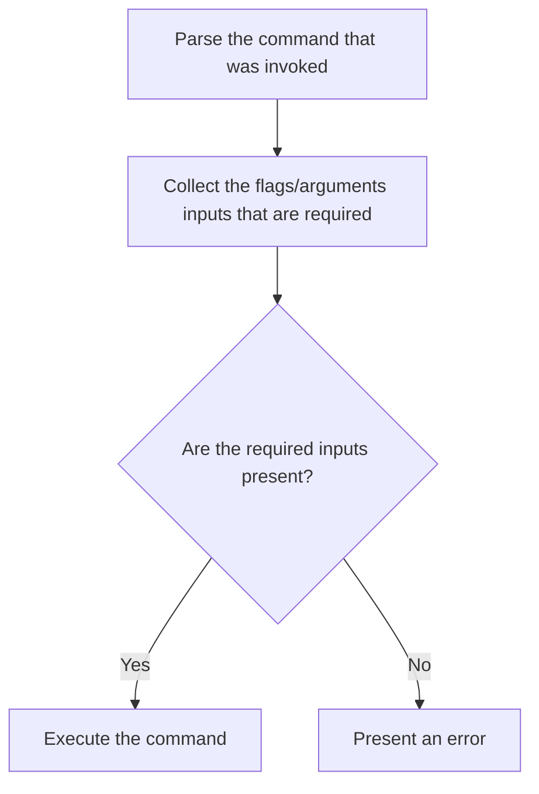
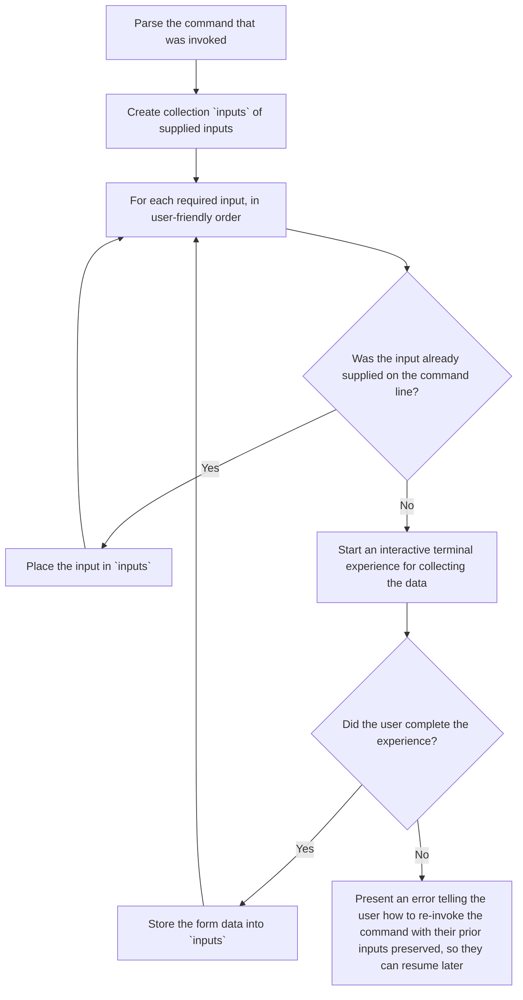

# Generalized Interactivity Design

Relating to the [Interactive Domain Purchase Wizard](./interactive_domain_wizard.md) topic, I'd like to step back a bit and generalize the problem space. What we don't want is to build one-off interactive experiences as special exceptions in the CLI. Rather, we need to start supporting interactivity across all `gddy` commands, where appropriate, and part of that is making sure that interactivity enters into commands in a consistent manner.

This proposal outlines the generalized technique for how we construct commands with interactivity.

## Purpose of interactivity

Command execution currently follows this flow:

A user that has all of the required inputs does not want or need an interactive experience; this is especially common in the case of writing a shell script to automate tasks. A user that isn't already familiar with the input requirements, however, most likely does not prefer receiving error messages with corrective guidance. Instead, we can prompt the user to fill in what is needed interactively so they don't have to re-invoke a corrected command. We can follow this algorithm instead:

So essentially, interactivity is triggered by missing command inputs. Users can either do a one-shot command execution or be walked through a wizard experience.

## The `--interactive`/`--non-interactive` flags

The `gddy` binary should have a new `--interactive` and `--non-interactive` pair of flags (if Clap has a more natural way to represent boolean flags we can consider just making these aliases akin to the `--output` shortcut flags). We already have established precedence of detecting interactive terminals (TTYs) and selecting the experience based on that. For example, the `--human` output mode (tabular data display) is selected as the default for TTYs, whereas JSON output is selected for non-TTYs. We should follow this same pattern for the `--interactive` flag. TTYs should have `--interactive` enabled by default, because a human trying to accomplish a task probably does not want to be interrupted by an error and have to re-enter a command with corrections.

For agentic experiences, the `--interactive` flag will not be set by default, so we'll retain the current error/suggestion feedback loop. Agents can present their own interactive interface with the user, getting input from conversational context or through user prompts of its own. For shell scripts, the `--interactive` flag will also not be set; in that case we do want to retain the current error exit codes with helpful error messages so those developing/debugging the scripts can fix them.

This flag defaulting behavior should mean that you'll rarely want to set/negate the flag, but it remains as an option for users that never want terminal interactivity or for agents/scripts that for some unfathomable reason want to mess around with stdin to control an interactive experience.

## Library selection

The simple case — text input for a missing argument, select/multiselect from a list, confirm, with validation — is well served by a line-based prompt library rendered in normal terminal scrollback. But the [Interactive Domain Purchase Wizard](./interactive_domain_wizard.md) raises the bar: multi-step flows with a running cart/price total, a consistent step indicator, and enough visual polish to feel like a real wizard rather than a sequence of questions. That pushes the real decision up a level, to how much of the terminal we take over.

### The core fork: full-screen vs. inline/scrollback

**Full-screen (alternate-screen) apps** own the whole terminal for the duration of the wizard, redrawing the frame as state changes.

- Pro: persistent layout — a step indicator, running total, and current prompt can all be visible at once, which is where visual "wow factor" actually comes from.
- Pro: one render loop / state machine per wizard, a natural place to build a shared template (header, step progress, keybinding hints) reused across every `gddy` wizard.
- Con: scrollback disappears while it runs — a user can't scroll up to see what they answered two steps ago or copy the transcript, which breaks from how the rest of the CLI already behaves (everything printed stays in scrollback).
- Con: a second UI runtime alongside clap dispatch, not a function call that returns a value into `inputs` — more state to own, more to test.

**Inline apps** print each prompt in place, in normal terminal flow, one after another.

- Pro: fits the CLI's existing model — each prompt is a function call that blocks, returns a value, and leaves its answer in scrollback like any other command output.
- Pro: small integration surface: prompts are just calls returning `Result<T>`, easy to unit test.
- Con: flatter by construction — no persistent side panel or simultaneous multi-field view; polish has to come from within each individual prompt (color, fuzzy filtering, formatting) rather than overall layout.

Neither approach determines whether we get a shared wizard template — that's a layer we build ourselves either way. The fork is really about how much visual richness we want per step vs. how much of the terminal (and scrollback) we're willing to give up to get it.

### Inline candidates

**[dialoguer](https://docs.rs/dialoguer)** (~74M downloads) and **[inquire](https://docs.rs/inquire)** (~18.5M downloads) both give `Select`, `MultiSelect`, `Text`/`Input`, `Confirm` out of the box, rendered inline. inquire is the newer of the two with more flexible validators/formatters and fuzzy-filtering on `Select`; dialoguer is older (2017) and more widely used as a transitive dependency, but its customization hooks are narrower. Critically, **neither exposes a widget SDK** — both are a fixed catalog of prompt types you configure, not compose. If we want custom widgets while staying inline, this pair can't get us there.

**[promkit](https://docs.rs/promkit)** (~92K downloads) is built for exactly that gap: it renders inline (no alt-screen, scrollback preserved) but exposes a `Prompt` trait and reusable widget states (text editing, lists, trees, table/JSON viewers) that the application composes itself, rather than a fixed catalog. It's the closest match to "inquirer-style but composable" — at the cost of being a much smaller, newer crate, so more maturity risk than inquire or dialoguer.

### Full-screen candidates

**[ratatui](https://ratatui.rs)** (~42M downloads) is the dominant Rust TUI crate, but it's immediate-mode and low-level: you own the render loop and redraw the full frame yourself, with no built-in "pick from a list" or dialog widgets. Anything wizard-shaped (steps, forms, cart summary) would be built from primitives.

**[cursive](https://docs.rs/cursive)** (~1.7M downloads) is also full-screen but retained-mode and higher-level: a `View` trait plus a tree of composed views, with dialogs, menus, buttons, layout managers, and theming shipped in, driven by callbacks. It supports four backends (crossterm, ncurses, termion, pancurses). For a forms/dialog-heavy wizard specifically, cursive gets us closer to off-the-shelf than ratatui does; ratatui's advantage is its larger ecosystem and lower-level control if cursive's opinions ever get in the way.

### Open question

This proposal doesn't yet commit to a side. The two live paths are:

1. **Stay inline** with inquire/dialoguer for simple prompts, and reach for promkit if/when a step needs a genuinely custom widget — accepting promkit's smaller footprint as the tradeoff for keeping scrollback.
2. **Go full-screen** with cursive for wizard-heavy commands — accepting the scrollback loss for a richer, more consistent shared template — while keeping inquire/dialoguer around for one-off missing-argument prompts on commands that don't need a full wizard.

## Confirmation for mutating commands

Today, `.mutates(true)` on a `CommandSpec` only feeds `--dry-run` short-circuiting; there's no engine-level "are you sure?" gate. Commands that want confirmation before a mutation (e.g. `domain purchase`) implement it by hand with their own `--confirm` flag. Under the generalized interactivity model, this is a natural gap to close: a mutating command, run interactively, without an explicit confirmation flag, should get an automatic confirmation prompt rather than requiring every handler to hand-roll its own.

cli-engine already has an integration point for this: `Authorizer`, an async hook invoked before a command's business logic runs, given `command_path`, `args`, a lazy `CredentialResolver`, the `--reason` string, and the command's `Tier` (`Read`/`Mutate`/`Destructive`). At first glance this looks like a pure identity/permission check, unrelated to interactive UX — but `gdx` (`../gdx/rust/src/authz/mod.rs`) shows it's already used for exactly this. Its `Authorizer` impl resolves a policy-driven permission mode per command/tier — `allow`, `never`, `ask`, `challenge`, or delegate to a named exec-gate provider — and `ask`/`challenge` genuinely pause and wait on a human decision, with `challenge` requiring a typed confirmation code and a mandatory `--reason`. So "may this proceed" already legitimately includes "only if a human confirms it right now," and centralizing that in `Authorizer` is precisely what makes it automatic per-tier instead of hand-rolled per command.

One important difference from what we'd want here: gdx's confirmation is deliberately out-of-band. Its `InteractiveGate` never reads from stdin — it's a native OS dialog (`osascript` on macOS) or a local `axum` server opened in a browser tab, specifically so it works even when stdin isn't a usable TTY (e.g. an agent-driven invocation). For `gddy`, since this proposal's whole premise is a same-terminal, `--interactive`-gated experience, we'd want the equivalent gate to render as a terminal prompt (whichever library the section above lands on) rather than a browser popup, and to trigger only when `--interactive` is active.

Two things worth carrying into the eventual design:

- **Borrow gdx's policy-driven permission model instead of a blanket rule.** Rather than "mutates ⇒ always confirm," let confirmation requirements vary by command/tier via policy (`allow`/`ask`/`challenge`/etc.), the way gdx does. Not every `Mutate`-tier command is equally risky, and a blanket prompt on all of them would train users to reflexively hit "yes."
- **This lives in cli-engine, not just `gddy`.** `Tier`, `CommandSpec`, `Middleware`, and `Authorizer` are all defined in cli-engine, which `gddy` consumes as a pinned crates.io version rather than a path dependency. Any engine-level confirmation primitive beyond what `Authorizer` already exposes would need to land in cli-engine first, with a version bump here to pick it up — this isn't purely a `gddy`-side wiring decision.
