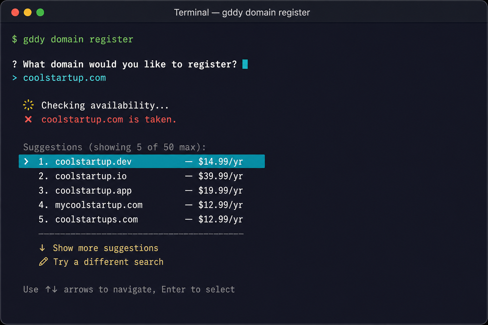
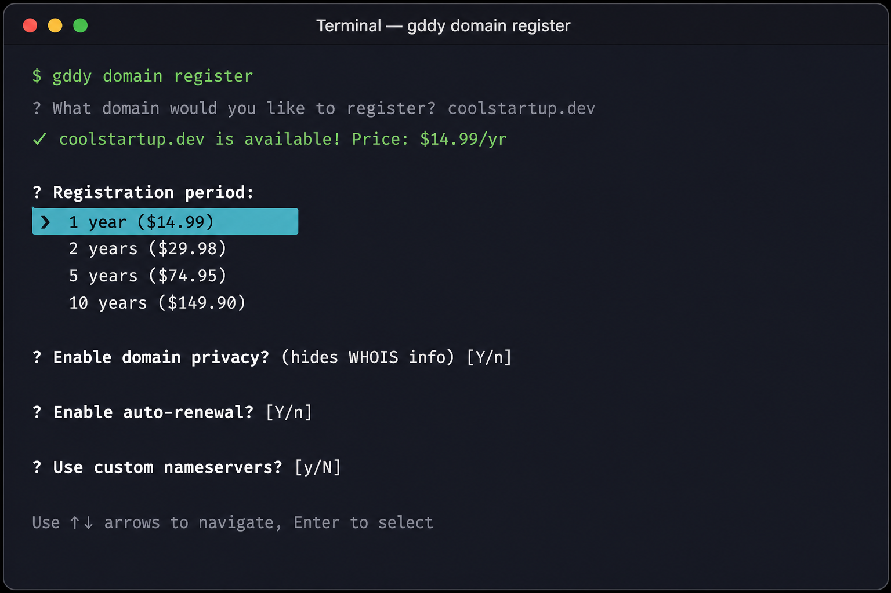
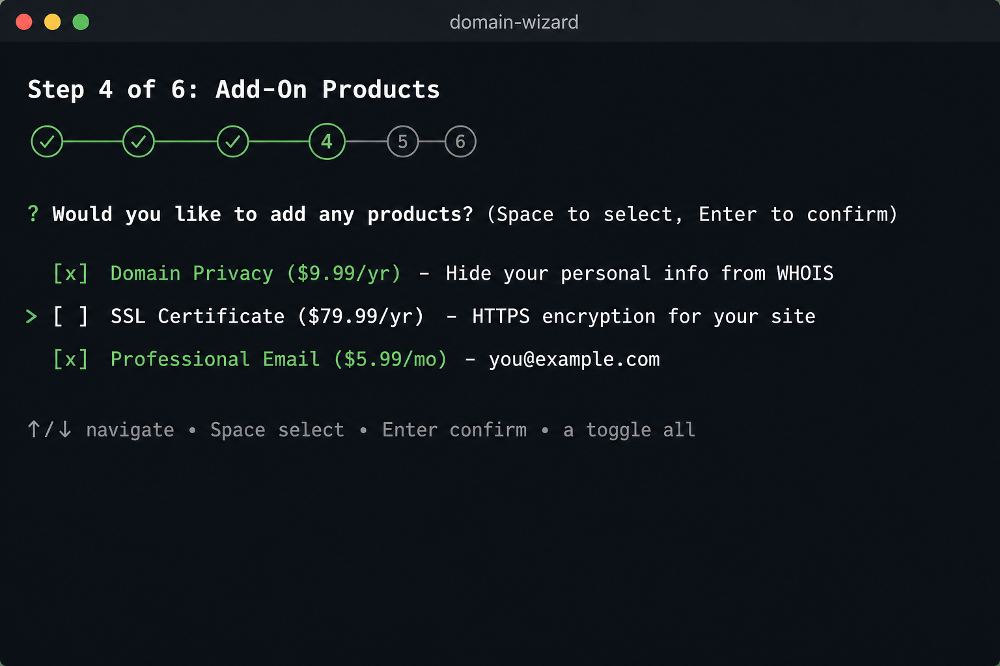
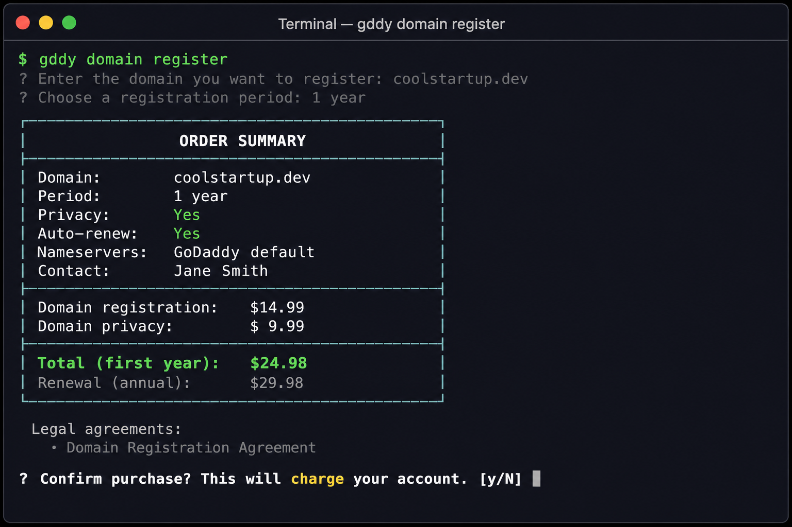
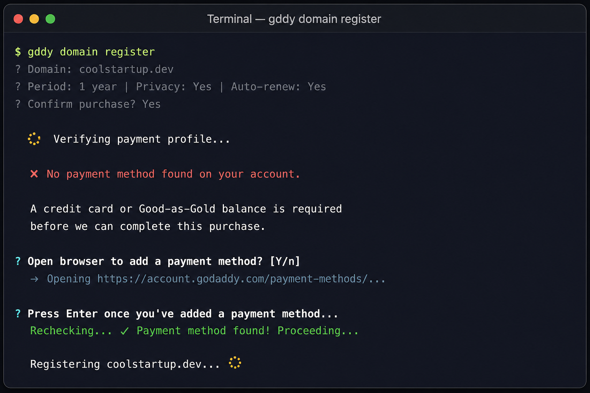
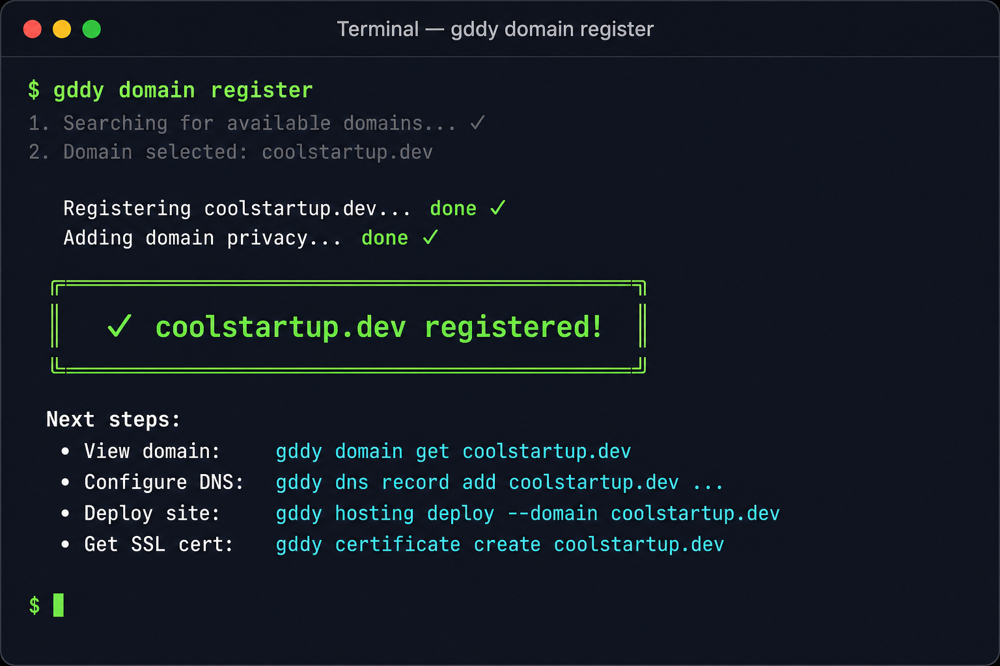

# Design: Interactive Domain Purchase Wizard

---

## Problem Statement

Today, purchasing a domain through `gddy` requires a multi-step, manual process:

```bash
gddy domain available example.com          # Step 1: check availability
gddy domain quote example.com --privacy    # Step 2: get a quote
gddy domain purchase --quote-token <token> --agree --confirm  # Step 3: buy
```

This is correct for scripting/CI but is a poor experience for interactive users. A developer wanting to register a domain must:
1. Know the exact three-command flow
2. Remember to copy the `--quote-token` between commands
3. Understand that `--agree` and `--confirm` are separate consent gates
4. Know about `--privacy`, `--nameserver`, contacts configuration, etc.

Compare to Shopify (`shopify app init`) or Cloudflare (`wrangler init`) which guide users step-by-step with prompts, defaults, and validation at each stage.

## Goals

- Single interactive command that walks users through domain discovery → quote review → purchase
- Support attaching add-on products (privacy, SSL certificates, email, website builder) at purchase time
- Respect the existing quote-execute API model (v3 Domains API)
- Support attaching DNS records and nameservers as part of the flow
- Non-interactive mode falls back to the existing `domain available` + `quote` + `purchase` pipeline
- Interactive mode defaults to human-readable output; JSON available via `--output json`

## API Surface

### GoDaddy REST APIs Used

Based on [GoDaddy REST API Reference](https://developer.godaddy.com/en/docs/references/rest):

| API | Version | Operations Used | Auth |
|-----|---------|----------------|------|
| Domains & DNS | v3 | `POST /v3/domains/available` (availability check) | OAuth |
| Domains & DNS | v3 | `POST /v3/domains/registration/quote` (price lock) | OAuth |
| Domains & DNS | v3 | `POST /v3/domains/registration` (register/execute) | OAuth |
| Domains & DNS | v1 | `GET /v1/domains/suggest` (suggestions) | OAuth |
| Agreements | v1 | `GET /v1/domains/agreements` (legal agreements by TLD) | OAuth |
| Certificates | v1 | `POST /v1/certificates` (order SSL cert) | OAuth |
| Shoppers | v1 | `GET /v1/shoppers/{shopperId}` (payment methods check) | OAuth |
| Countries | v1 | `GET /v1/countries` (contact address validation) | OAuth |

### Product Attachment APIs

After domain registration, the wizard offers to attach:

| Product | API | Operation |
|---------|-----|-----------|
| Domain Privacy | Domains v1 | `POST /v1/domains/{domain}/purchase/privacy` |
| SSL/TLS Certificate | Certificates v1 | `POST /v1/certificates` with domain validation |
| Professional Email | Email API | `POST /v1/email/domains/{domain}` |
| DNS Records | Domains v1 | `PATCH /v1/domains/{domain}/records` |
| Website Builder | (future) | Placeholder for hosting product integration |

## Command Design

### Multi-Entry-Point Approach

The wizard is not limited to a single `domain register` command. Any domain subcommand
can serve as an entry point into the purchase flow via the `--interactive` flag. The
command does its normal work, then hands off to the wizard from the appropriate step
with pre-filled state.

```
gddy domain <subcommand> [args] --interactive
```

#### Entry Points

| Command | What it does first | Wizard starts at | Pre-filled state |
|---------|-------------------|------------------|------------------|
| `gddy domain register` | Nothing (dedicated wizard entry) | Step 1: Discovery | — |
| `gddy domain suggest example --interactive` | Fetches suggestions | Step 1: Pick from results | Search term + suggestions |
| `gddy domain available example.com --interactive` | Checks availability | Step 2 (if available) or Step 1 suggestions (if taken) | Domain + availability status |
| `gddy domain quote example.com --interactive` | Locks a quote | Step 5: Review & Confirm | Domain + quote token + price |

#### How it works

```
┌────────────────────────────────────────────────────────────────────┐
│  gddy domain suggest "cool startup" --interactive                   │
├────────────────────────────────────────────────────────────────────┤
│                                                                    │
│  1. Normal command logic runs:                                     │
│     → calls /v1/domains/suggest, gets results                      │
│                                                                    │
│  2. --interactive detected + TTY present:                          │
│     → injects results into WizardState { suggestions: [...] }      │
│     → enters wizard at Step 1 (user picks from suggestions)        │
│     → continues through Steps 2 → 3 → 4 → 5 → 5b → 6             │
│                                                                    │
│  Without --interactive:                                            │
│     → prints JSON results and exits (existing behavior)            │
│                                                                    │
└────────────────────────────────────────────────────────────────────┘
```

#### Commands that ignore `--interactive`

Not all domain subcommands lead naturally into a purchase. These ignore the flag
(or warn that it's not applicable):

- `gddy domain list` — shows owned domains, not a purchase path
- `gddy domain get` — inspects an existing domain
- `gddy domain contacts init` — local file setup, no purchase context
- `gddy domain dns *` — DNS management for existing domains

#### Primary entry: `gddy domain register`

The dedicated wizard command remains the canonical entry point:

```
gddy domain register [DOMAIN] [--interactive | --non-interactive]
```

When `DOMAIN` is provided and `--non-interactive` is set (or stdin is not a TTY), it
falls through to the existing `quote` + `purchase` pipeline. Otherwise, it enters the
interactive wizard at Step 1.

### Wizard Flow

#### Visual Mockups

| Step 1: Discovery | Step 2: Options |
|:-:|:-:|
|  |  |

| Step 4: Add-Ons | Step 5: Confirmation |
|:-:|:-:|
|  |  |

| Step 5b: Payment Gate | Step 6: Success |
|:-:|:-:|
|  |  |

#### Step-by-Step Flow Diagram

```
┌──────────────────────────────────────────────────────────────┐
│                     gddy domain register                      │
└──────────────────────┬───────────────────────────────────────┘
                       │
                       ▼
┌──────────────────────────────────────────────────────────────┐
│  Step 1: Domain Discovery                                     │
│  ┌─────────────────────────────────────────────────────────┐ │
│  │ ? What domain would you like to register?               │ │
│  │ > example.com                                           │ │
│  │                                                         │ │
│  │   Checking availability...                              │ │
│  │   ✓ example.com is available!                           │ │
│  │   Price: $12.99/yr (renewal: $19.99/yr)                 │ │
│  │                                                         │ │
│  │   OR                                                    │ │
│  │   ✗ example.com is taken.                               │ │
│  │   Suggestions (showing 5 of 50 max):                    │ │
│  │     1. example.dev    — $14.99/yr                       │ │
│  │     2. example.io     — $39.99/yr                       │ │
│  │     3. example.app    — $19.99/yr                       │ │
│  │     4. myexample.com  — $12.99/yr                       │ │
│  │     5. getexample.com — $12.99/yr                       │ │
│  │   ──────────────────────────────────────────────────    │ │
│  │     ↓ Show more suggestions                             │ │
│  │     ✎ Try a different search                            │ │
│  │                                                         │ │
│  │   ? Select a domain:                                    │ │
│  └─────────────────────────────────────────────────────────┘ │
└──────────────────────┬───────────────────────────────────────┘
                       │
                       ▼
┌──────────────────────────────────────────────────────────────┐
│  Step 2: Registration Options                                 │
│  ┌─────────────────────────────────────────────────────────┐ │
│  │ ? Registration period:                                  │ │
│  │   > 1 year ($12.99)                                     │ │
│  │     2 years ($25.98)                                    │ │
│  │     5 years ($64.95)                                    │ │
│  │                                                         │ │
│  │ ? Enable domain privacy? (hides WHOIS info) [Y/n]: Y   │ │
│  │ ? Enable auto-renewal? [Y/n]: Y                         │ │
│  │ ? Custom nameservers? [y/N]: N                          │ │
│  └─────────────────────────────────────────────────────────┘ │
└──────────────────────┬───────────────────────────────────────┘
                       │
                       ▼
┌──────────────────────────────────────────────────────────────┐
│  Step 3: Contact Information                                  │
│  ┌─────────────────────────────────────────────────────────┐ │
│  │ Registrant contact required for this TLD.               │ │
│  │                                                         │ │
│  │ ? Use saved contacts from contacts.toml? [Y/n]: Y      │ │
│  │   Using: Jane Smith (jane@example.com)                  │ │
│  │                                                         │ │
│  │ OR (if no contacts.toml):                               │ │
│  │ ? First name: Jane                                      │ │
│  │ ? Last name: Smith                                      │ │
│  │ ? Email: jane@example.com                               │ │
│  │ ? Phone: +1.4805551234                                  │ │
│  │ ? Organization (optional):                              │ │
│  │ ? Address line 1: 123 Main St                           │ │
│  │ ? City: Scottsdale                                      │ │
│  │ ? State: AZ                                             │ │
│  │ ? Postal code: 85260                                    │ │
│  │ ? Country: US                                           │ │
│  │                                                         │ │
│  │ ? Save to contacts.toml for future registrations? [Y/n] │ │
│  │   (saved locally at ~/.config/gddy/contacts.toml)       │ │
│  │                                                         │ │
│  │ OR (if no contacts.toml AND user declines to enter):    │ │
│  │   Using your GoDaddy account's default contact.         │ │
│  └─────────────────────────────────────────────────────────┘ │
└──────────────────────┬───────────────────────────────────────┘
                       │
                       ▼
┌──────────────────────────────────────────────────────────────┐
│  Step 4: Add-On Products                                      │
│  ┌─────────────────────────────────────────────────────────┐ │
│  │ ? Would you like to add any of these products?          │ │
│  │   [x] Domain Privacy ($9.99/yr) — hide WHOIS info       │ │
│  │   [ ] SSL Certificate ($79.99/yr) — HTTPS for your site │ │
│  │   [ ] Professional Email ($5.99/mo) — you@example.com   │ │
│  │   [ ] Website Builder ($6.99/mo) — drag-and-drop site   │ │
│  └─────────────────────────────────────────────────────────┘ │
└──────────────────────┬───────────────────────────────────────┘
                       │
                       ▼
┌──────────────────────────────────────────────────────────────┐
│  Step 5: Quote Review & Confirmation                          │
│  ┌─────────────────────────────────────────────────────────┐ │
│  │                 Order Summary                            │ │
│  │ ────────────────────────────────────────────────────     │ │
│  │ Domain: example.com                                     │ │
│  │ Period: 1 year                                          │ │
│  │ Privacy: Yes                                            │ │
│  │ Auto-renew: Yes                                         │ │
│  │ Nameservers: GoDaddy default                            │ │
│  │ Contact: Jane Smith (jane@example.com)                  │ │
│  │                                                         │ │
│  │ ────────────────────────────────────────────────────     │ │
│  │ Domain registration:     $12.99                         │ │
│  │ Domain privacy:          $ 9.99                         │ │
│  │ ────────────────────────────────────────────────────     │ │
│  │ Total (first year):      $22.98                         │ │
│  │ Renewal (annual):        $29.98                         │ │
│  │                                                         │ │
│  │ Legal agreements:                                       │ │
│  │ • Domain Registration Agreement (https://...)           │ │
│  │ • Privacy Agreement (https://...)                       │ │
│  │                                                         │ │
│  │ Quote token: qt_abc123... (expires in 9 minutes)        │ │
│  │                                                         │ │
│  │ ? Confirm purchase? This will charge your account. [y/N]│ │
│  └─────────────────────────────────────────────────────────┘ │
└──────────────────────┬───────────────────────────────────────┘
                       │ (user confirms)
                       ▼
┌──────────────────────────────────────────────────────────────┐
│  Step 5b: Payment Verification (gate — after confirmation)    │
│  ┌─────────────────────────────────────────────────────────┐ │
│  │   Verifying payment profile...                          │ │
│  │   ✓ Payment method on file (Visa ending 4242)           │ │
│  │                                                         │ │
│  │   OR                                                    │ │
│  │   ✗ No payment method found on your account.            │ │
│  │                                                         │ │
│  │   A credit card or Good-as-Gold balance is required     │ │
│  │   before we can complete this purchase.                 │ │
│  │                                                         │ │
│  │   ? Open browser to add a payment method? [Y/n]: Y      │ │
│  │     → Opening https://account.godaddy.com/payment-...   │ │
│  │                                                         │ │
│  │   ? Press Enter once you've added a payment method...   │ │
│  │     Rechecking... ✓ Payment method found! Proceeding... │ │
│  └─────────────────────────────────────────────────────────┘ │
└──────────────────────┬───────────────────────────────────────┘
                       │ (payment verified)
                       ▼
┌──────────────────────────────────────────────────────────────┐
│  Step 6: Execution & Post-Registration                        │
│  ┌─────────────────────────────────────────────────────────┐ │
│  │ Registering example.com... done                         │ │
│  │ Adding domain privacy... done                           │ │
│  │                                                         │ │
│  │ ✓ example.com registered successfully!                  │ │
│  │                                                         │ │
│  │ Next steps:                                             │ │
│  │ • View domain:  gddy domain get example.com             │ │
│  │ • Add DNS:      gddy dns record add example.com ...     │ │
│  │ • Deploy site:  gddy hosting deploy --domain example.com│ │
│  └─────────────────────────────────────────────────────────┘ │
└──────────────────────────────────────────────────────────────┘
```

### 4.3 Non-Interactive Equivalent

Every choice in the wizard maps to a CLI flag for scripting:

```bash
gddy domain register example.com \
  --period 1 \
  --privacy \
  --auto-renew \
  --add ssl-certificate \
  --agree \
  --confirm \
  --non-interactive
```

**Key design decisions:**

1. **Late gate (after confirmation, before execution):** The payment check runs *after* the user has reviewed the full order and pressed "confirm" — but *before* the register API call. This means:
   - Users can browse domains, see prices, and review quotes freely (useful for price discovery)
   - The quote token (~10 min TTL) is still fresh since only seconds pass between confirmation and this check
   - The gate only blocks the irreversible action (charging the account)

2. **Fail-open on auth errors:** If the payment check API returns 401/403 (e.g. the scope isn't available yet), we skip the gate optimistically. The purchase step will catch the real 402 failure with a clear error. This prevents a missing scope from blocking the entire wizard.

3. **Single retry loop:** We don't poll indefinitely. The user gets one chance to add a payment method and confirm. If it still fails, they get a clear error with the `gddy payment-methods add` fallback command.

4. **Non-interactive mode:** In `--non-interactive` mode, this step silently checks and fails immediately with a clear error message if no payment method exists (no prompts, no browser open). This gives CI scripts a fast-fail before the paid API call.

5. **Quote token safety:** Since the v3 quote token is single-use and expires in ~10 minutes, placing the payment gate *after* the quote review (Step 5) but *before* execution (Step 6) means the token hasn't been consumed yet. If the user needs to go add a payment method (takes ~2 minutes), the token is still valid when they return.


### Suggestion Pagination Strategy

The v3 suggestions API (`GET /v3/domains/suggestions`) has these constraints:
- `pageSize` parameter: 1–50 (server hard cap at 50, enforced in `suggest.rs`)
- No offset/cursor parameter: the API returns a fresh set each call, ordered by relevance
- Response time scales with `pageSize` (~200ms for 5, ~600ms for 50)

**Design decision: Progressive disclosure with "Show more"**

| Constant | Value | Rationale |
|----------|-------|-----------|
| `INITIAL_SUGGESTION_PAGE` | 5 | Fast first-paint (~200ms). Most users pick from top suggestions. |
| `MORE_SUGGESTIONS_PAGE` | 10 | Each "Show more" adds 10 (fetches full batch, deduplicates). |
| `MAX_SUGGESTIONS` | 50 | Server hard cap. After this, "Show more" disappears. |

**How it works:**

1. First fetch: `pageSize=5` → show 5 domains + "↓ Show more" + "✎ Try different"
2. User picks "Show more": fetch with `pageSize=15`, deduplicate, show all 15
3. User picks "Show more" again: fetch with `pageSize=25`, deduplicate, show all 25
4. Continues until 50 reached (server cap), then "Show more" option disappears

**Why not true pagination (offset)?** The v3 API doesn't support offset-based pagination for suggestions. It returns a relevance-ranked set sized by `pageSize`. To show "more", we request a larger batch and deduplicate against previously shown items. In practice, the server returns a superset of the smaller request, so deduplication works well.

**Non-interactive fallback:** In scripting mode, `--limit N` (1–50) controls the count directly, matching the existing `gddy domain suggest --limit` behavior.


### Output Modes

The wizard uses **human-readable output by default** in interactive mode. Preserving
JSON scriptability is unnecessary when the user is actively participating in a guided
experience — the interactive flow is inherently human.

| Mode | Default output | Rationale |
|------|---------------|-----------|
| Interactive (TTY detected) | Human-friendly summary | User is present; colors, tables, and guidance are appropriate |
| Non-interactive (`--non-interactive` or no TTY) | JSON envelope | Script/agent is driving; structured output for parsing |
| Explicit override (`--output json`) | JSON envelope | User/agent explicitly requests structured output |

**Interactive mode output (default):**

```
✓ example.com registered successfully!

  Domain:       example.com
  Period:       1 year
  Privacy:      Enabled
  Auto-renew:   Enabled
  Total charged: $22.98

  Next steps:
    gddy domain get example.com        View domain details
    gddy dns record add example.com    Configure DNS
    gddy hosting deploy --domain ...   Deploy a site
```

**Non-interactive / `--output json` mode:**

```json
{
  "result": {
    "domain": "example.com",
    "status": "COMPLETED",
    "operationId": "op_abc123",
    "price": "$22.98",
    "currency": "USD",
    "addons": ["privacy"],
    "period": 1,
    "privacy": true,
    "autoRenew": true
  },
  "system": "domain",
  "next_actions": [
    {"command": "domain get example.com", "description": "View domain details"},
    {"command": "dns record add example.com ...", "description": "Configure DNS"}
  ]
}
```

This aligns with how Shopify CLI and `gh` handle interactive flows — human-friendly
output by default, JSON as opt-in for when it's actually needed.

### Error Handling & Recovery

| Failure Point | Recovery |
|---------------|----------|
| Payment check: no methods | Open browser → wait → re-verify (Step 0 gate) |
| Payment check: API unavailable | Fail-open (optimistic), let purchase step catch real error |
| Availability check fails | Retry prompt with clear error |
| Quote API returns unavailable | Suggest alternatives, loop back to Step 1 |
| Quote expires mid-wizard | Auto-refresh quote before executing |
| Payment method removed mid-wizard | Server returns 402 at purchase → clear error with `payment-methods add` |
| Registration fails (server) | Show operation ID, suggest `gddy domain operation status` |
| User presses Ctrl+C | Clean exit, no state persisted, no charge |
| Network timeout on any step | Retry with exponential backoff (3 attempts) |

### Contacts Integration

**Important: contacts are stored locally, not via API.**

The GoDaddy API does **not** provide a server-side endpoint to save/manage contact
profiles. Instead, contacts work in one of two ways:

1. **Local `contacts.toml`** — saved at `~/.config/gddy/contacts.toml` on the user's
   machine. Read at quote time, bound into the quote token. Written by `gddy domain
   contacts init` (scaffold) or by the wizard's "save for future" prompt.
2. **Account-level default** — if no local contact is configured, the Domains API uses
   the account's default contact (managed via the GoDaddy web dashboard, not the CLI).

The wizard leverages this by:
- Checking for existing `contacts.toml` first (fast, no API call)
- If absent, offering to use the account default (no contact info needed at all)
- If the user enters details interactively, saving them to the **local** `contacts.toml`


## Product Attachment Post-Registration

After the domain is registered, add-on products are provisioned sequentially


## Testing Strategy

* Unit Tests
* Integration Tests (Mocked APIs)
* Manual Testing

## Open Questions

1. **Product pricing API:** Do we have a real-time pricing API for add-ons (privacy, SSL, email), or are prices hardcoded/fetched from a catalog?
2. **Multi-domain registration:** Should `gddy domain register` accept multiple domains (batch mode)?
4. **TLD-specific requirements:** Some TLDs (.uk, .au) have extra registrant requirements. How deep should the wizard go for these?
5. **Existing `domain purchase` command:** Should `register` replace it, or coexist as the "interactive" alias?
   - **Recommendation:** Coexist. `register` is the guided wizard; `purchase` remains the low-level execute-from-quote command for scripts.

## Agent-Driven Workflows

AI coding agents (Cursor, GitHub Copilot, custom MCP-based agents) can already orchestrate
multi-step CLI flows by chaining atomic commands and presenting choices in their own UI.
The interactive wizard and the agent-driven path are **complementary**, not competing.

### How agents use the CLI today

The GoDaddy CLI's design is already agent-friendly:

1. **Structured JSON output** — every command returns machine-parseable JSON
2. **`next_actions` field** — tells agents what command to run next
3. **`--output json`** — guaranteed stable contract for parsing
4. **`--confirm` / `--agree` flags** — skip interactive prompts for automation
5. **Atomic commands** — each step is independently callable

### Agent flow (no wizard needed)

```
┌─────────────────────────────────────────────────────────────────┐
│  AI Agent (Cursor, Copilot, MCP client)                         │
├─────────────────────────────────────────────────────────────────┤
│                                                                 │
│  1. gddy domain available example.com --output json             │
│     → Agent reads suggestions, presents to user in chat UI      │
│                                                                 │
│  2. User says: "I want example.com for 2 years with privacy"   │
│                                                                 │
│  3. gddy domain quote example.com --period 2 --privacy          │
│        --output json                                            │
│     → Agent shows price breakdown in rich card/table            │
│                                                                 │
│  4. User says: "Go ahead"                                       │
│                                                                 │
│  5. gddy domain purchase --token <token> --agree --confirm      │
│        --output json                                            │
│     → Agent confirms success, shows next_actions                │
│                                                                 │
│  6. Agent offers: "Want me to set up DNS records or add SSL?"   │
│     (driven by next_actions in the purchase response)           │
│                                                                 │
└─────────────────────────────────────────────────────────────────┘
```

The agent **is** the wizard — it reads JSON, makes decisions, asks the user in its own
UI (chat bubbles, cards, approval buttons), and calls the next command. No `dialoguer`
prompts needed.

### When to use which mode

| Mode | Audience | Interaction | Requires TTY |
|------|----------|-------------|:------------:|
| Interactive wizard (`gddy domain register`) | Humans in a raw terminal | `dialoguer` prompts | Yes |
| Agent-driven (atomic commands) | AI agents, MCP clients | JSON in/out, agent UI | No |
| Scripted (`--confirm --agree`) | CI/CD, shell scripts | All flags pre-supplied | No |

### Design implications

The wizard design **does not conflict** with agent usage because:

- The wizard is just a convenience layer that calls the same underlying logic
  (`available` → `quote` → `purchase`) that agents call directly
- TTY detection already gates the wizard: when `!stdout.is_terminal()`, the command
  falls back to non-interactive mode (requires all flags or errors with guidance)
- `next_actions` in every response gives agents a self-describing API surface
- The wizard is opt-in (`gddy domain register`); the atomic commands remain the
  primary interface for agents (`gddy domain available`, `gddy domain quote`,
  `gddy domain purchase`)

### Enhancing the agent path

To make the agent path even smoother, consider:

1. **`--dry-run` on purchase** — returns the full execution plan as JSON without
   executing, so agents can preview and confirm with users
2. **Schema introspection** — `gddy domain purchase --schema` returns the JSON schema
   of required/optional inputs, letting agents auto-generate prompts
3. **Richer `next_actions`** — include parameter hints so agents can pre-fill flags:
   ```json
   {
     "next_actions": [
       {
         "command": "domain quote example.com",
         "description": "Get a price quote for this domain",
         "suggested_flags": ["--period 1", "--privacy"]
       }
     ]
   }
   ```
4. **MCP server wrapper** — expose `gddy` commands as MCP tools so agents can call
   them natively without shell invocation (see Plugin/Extension System design)

### Conclusion

The interactive wizard targets the "human at a terminal with no agent" use case. For
agent-assisted workflows, the existing atomic commands + JSON output + `next_actions`
already provide a superior experience — the agent presents richer UI (formatted tables,
approval buttons, context-aware suggestions) than a terminal wizard ever could.

**Both paths share the same underlying implementation** — the wizard's steps internally
call the same functions that the atomic commands expose. This ensures feature parity
and a single source of truth for business logic.
